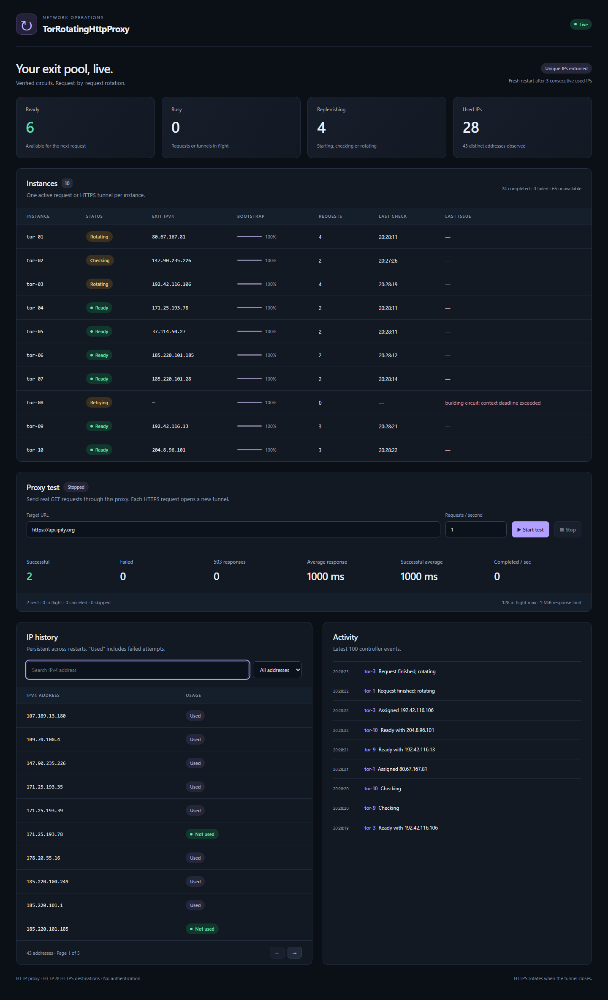

<p align="center">
  
</p>

<h1 align="center">TorRotatingHttpProxy</h1>

<p align="center">
  <strong>One HTTP proxy endpoint. A pool of verified Tor exits. A live dashboard.</strong>
</p>

<p align="center">
  <a href="https://github.com/bariskisir/TorRotatingHttpProxy/actions/workflows/ci.yml"></a>
  <a href="https://github.com/bariskisir/TorRotatingHttpProxy/tags"></a>
  <a href="https://hub.docker.com/r/bariskisir/torrotatinghttpproxy"></a>
  <a href="LICENSE"></a>
</p>

Run multiple Tor clients in a single Alpine-based Docker container. The application checks each exit IP and assigns ready instances to incoming requests. In unique mode it rotates the assigned instance when the request or HTTPS tunnel finishes; in reuse mode the verified circuit is kept and the same addresses keep serving.

- **HTTP proxy, no credentials** — supports HTTP destinations and HTTPS through CONNECT.
- **Unique IPs by default** — a persistent SQLite history prevents previously assigned IPv4 addresses from being assigned again.
- **Optional IP reuse** — set `UNIQUE_IP=false` to disable rotation: verified circuits are kept and the same addresses keep serving round-robin.
- **Automatic failover** — a pre-response upstream failure tries the next ready instance instead of returning 502. The client sees an error only when every instance fails.
- **Wait instead of instant 503** — when no eligible instance is ready, the request waits up to `CONNECT_TIMEOUT` for one instead of failing immediately.
- **Automatic fresh restarts** — three consecutive used-IP results rebuild that Tor instance from scratch. The threshold is configurable. Three consecutive serving failures do the same.
- **Live dashboard** — instance states, bootstrap progress, exit addresses, IP history and controller activity.
- **Built-in proxy tester** — configurable requests per second, Start/Stop, success/failure counts and response-time statistics.
- **Small application footprint** — one Go binary, embedded web assets, SQLite and Tor. No Node.js runtime, HAProxy, Privoxy or external database.

<p align="center">
  
</p>

---

## Quick start

From the cloned project directory:

```bash
docker build -t bariskisir/torrotatinghttpproxy .

docker run -d --name tor-proxy \
  --restart unless-stopped \
  -p 3128:3128 \
  -p 8080:8080 \
  -e TOR_COUNT=10 \
  -e UNIQUE_IP=true \
  -v tor-proxy-data:/data \
  bariskisir/torrotatinghttpproxy
```

PowerShell:

```powershell
docker build -t bariskisir/torrotatinghttpproxy .

docker run -d --name tor-proxy `
  --restart unless-stopped `
  -p 3128:3128 `
  -p 8080:8080 `
  -e TOR_COUNT=10 `
  -e UNIQUE_IP=true `
  -v tor-proxy-data:/data `
  bariskisir/torrotatinghttpproxy
```

| Endpoint | Address |
| --- | --- |
| HTTP proxy | `http://localhost:3128` |
| Dashboard | `http://localhost:8080` |
| Liveness | `http://localhost:8080/healthz` |
| Ready IP available | `http://localhost:8080/readyz` |

Open the dashboard and wait for at least one green **Ready** instance. Tor bootstrap can take several minutes, especially with a fresh volume. Other instances can keep bootstrapping while ready instances serve requests.

```bash
# HTTP destination
curl --proxy http://localhost:3128 http://api.ipify.org

# HTTPS destination through the same HTTP proxy
curl --proxy http://localhost:3128 https://api.ipify.org
```

Use `curl.exe` instead of `curl` in Windows PowerShell if `curl` is an alias. Each separate curl invocation opens a new connection.

Both endpoints are intentionally unauthenticated. The default port mappings make them available on the host's LAN address too. To bind only to the local computer, use `-p 127.0.0.1:3128:3128 -p 127.0.0.1:8080:8080`. A different host port works normally, for example `-p 9000:3128`.

For an application in another container on the same Docker network, set its HTTP proxy URL to `http://tor-proxy:3128`. The scheme is **http**, including when configuring an application's HTTPS proxy setting.

## Configuration

| Environment variable | Default | Meaning |
| --- | --- | --- |
| `TOR_COUNT` | `10` | Positive number of independent Tor processes. |
| `UNIQUE_IP` | `true` | `true`: reject previously assigned IPs and duplicate ready IPs, and rotate after every request or tunnel. `false`: keep verified circuits with no rotation; the same addresses keep serving round-robin. |
| `MAX_USED_IP_RETRIES` | `3` | Consecutive newly built circuits whose IP checks return a used IP before that instance is stopped, its Tor data directory removed, and a fresh process started. Only applies when `UNIQUE_IP=true`. |
| `IP_CHECK_URL` | `https://api.ipify.org` | HTTP(S) endpoint returning a single public IPv4 address as plain text. No redirects are followed. |
| `CONNECT_TIMEOUT` | `30s` | Connection setup, circuit build/check budget, built-in test request timeout, and how long a client request waits for a ready instance when the pool is empty. |
| `IDLE_TIMEOUT` | `120s` | Maximum inactivity on a proxy connection. Traffic in either direction keeps an active tunnel alive. |
| `BOOTSTRAP_TIMEOUT` | `5m` | Time allowed for an individual Tor process to reach bootstrap 100%. On expiry the instance is stopped, **only its own Tor state is removed**, and Tor is started from scratch. |
| `MAX_CONNECTIONS` | `1024` | Maximum accepted client connections on the proxy listener, including idle connections and CONNECT tunnels. |
| `PROXY_ADDR` | `:3128` | Proxy listen address inside the container. |
| `WEB_ADDR` | `:8080` | Dashboard and API listen address inside the container. |
| `DATA_DIR` | `/data` | Persistent database and Tor state directory. |
| `LOG_LEVEL` | `info` | Set to `debug` to include Tor notice logs. Logs are JSON on stdout. |

Duration values use Go syntax, such as `45s` or `2m`. Boolean configuration accepts exactly `true` or `false`. Invalid configuration fails at startup with a clear error.

Example with reusable IPs and 20 Tor instances:

```bash
docker run -d --name tor-proxy \
  -p 3128:3128 -p 8080:8080 \
  -e TOR_COUNT=20 \
  -e UNIQUE_IP=false \
  -e MAX_USED_IP_RETRIES=3 \
  -v tor-proxy-data:/data \
  bariskisir/torrotatinghttpproxy
```

Changing environment variables requires recreating the container. Reuse the same volume to keep the IP history.

## How requests are handled

```text
                        Single Docker container
                  ┌──────────────────────────────────────┐
HTTP proxy client ──► Go HTTP proxy :3128                  │
                  │        │                              │
                  │        ├── instance 1 ── Tor circuit ─────► destination
                  │        ├── instance 2 ── Tor circuit  │
                  │        └── instance N ── Tor circuit  │
                  │                                       │
Browser ────────────► Dashboard/API :8080                  │
                  │        │                              │
                  │        ├── live SSE updates            │
                  │        ├── SQLite /data/ips.db         │
                  │        └── test runner ──► proxy :3128 │
                  └──────────────────────────────────────┘
```

1. Start one Tor process per instance, using separate persistent state and private Unix sockets.
2. Build a circuit, attach an IP-check stream to that circuit and validate the returned IPv4 address.
3. Record the observed IP. In unique mode, reserve it only if it is unused and not reserved by another ready instance.
4. Select a ready instance in round-robin order, waiting up to `CONNECT_TIMEOUT` when none is eligible. **Commit `used=1` before forwarding any user traffic.** Only one request or CONNECT tunnel can own an instance at a time.
5. Attach the user's stream to the verified circuit. If attachment fails or the circuit closes, fail the request; never silently switch to an unverified circuit or a direct connection. If the upstream connection fails before any response bytes reach the client, fail over to the next ready instance instead of returning 502. Requests with a body are replayed only when the body provably never left (the dial never succeeded); failures after the response starts abort the stream and are never retried.
6. In unique mode, after the HTTP response body finishes, the HTTPS tunnel closes, or the request fails, close the old circuit and start rotation. In reuse mode (`UNIQUE_IP=false`) a healthy verified circuit is kept and the instance serves the next request with the same IP; only a failed assignment rotates. Retry delays after failures grow from approximately 10 to 60 seconds, with jitter.
7. After `MAX_USED_IP_RETRIES` consecutive used-IP results, stop and reap that Tor process, delete **only its own Tor state**, and bootstrap it from scratch. Three consecutive serving failures on one instance trigger the same rebuild because rotation did not help. Other instances and SQLite history stay intact. A non-used-IP cycle breaks the consecutive count. A bootstrap that does not reach 100% within `BOOTSTRAP_TIMEOUT` is treated the same way: the instance is rebuilt from scratch instead of retrying a wedged process, and its last-error text is cleared as soon as a new attempt reports a clean state.

Tor speaks SOCKS internally. The application uses private SOCKS connections to Tor, with temporary generation tags to prevent late streams from attaching to a newer circuit. **This does not make the public proxy a SOCKS proxy and does not require a username or password from clients.** DNS resolution for destination hostnames is performed through Tor.

The controller uses Tor's [`ATTACHSTREAM`](https://spec.torproject.org/control-spec/commands.html#attachstream) to pin streams and [`NEWNYM`](https://spec.torproject.org/control-spec/commands.html#signal) as part of rotation. A NEWNYM signal alone is not proof of a new IP; every candidate is checked again.

### HTTP versus HTTPS rotation

For plain HTTP, one request consumes one IP assignment in unique mode, even if the client reuses its connection to the proxy. Responses are streamed without buffering the entire body. Redirects are returned to the client, and requests are not automatically replayed on failure.

For HTTPS, one **CONNECT tunnel** consumes one assignment in unique mode. The proxy does not decrypt TLS or install certificates. Multiple HTTPS requests or HTTP/2 streams inside one tunnel therefore use the same IP. To obtain a new assignment for each HTTPS request, configure the client to create a new tunnel rather than reusing a pooled connection.

In reuse mode (`UNIQUE_IP=false`) there is no per-request or per-tunnel rotation: verified circuits are kept, so consecutive requests cycle through the same addresses in round-robin order. A new circuit is built only when the verified one dies.

The built-in tester already disables connection reuse. HTTPS WebSockets remain inside their CONNECT tunnel until it closes. Plain HTTP protocol upgrades and `.onion` destinations are not supported. Exit traffic is IPv4-only so IP history and actual exit address family agree.

### Empty pool and failures

| Result | Meaning |
| --- | --- |
| `503 Service Unavailable` | No eligible ready instance appeared within `CONNECT_TIMEOUT`, connection limit reached, or the IP reservation could not be persisted. No waiting request queue beyond that budget is created. |
| `502 Bad Gateway` | Tor could not connect using the assigned circuit. |
| `504 Gateway Timeout` | Upstream setup exceeded the configured timeout. |
| Closed connection | An established tunnel or streaming response failed after response headers were already sent. |

Failed assignments automatically fail over to another ready instance, so in unique mode the next attempt usually uses a different exit while the failed one rotates. An IP is consumed even if the target returns an error or the client disconnects: after traffic may have been sent, the application cannot safely assume that the target did not see it.

## Dashboard and built-in tester

The dashboard uses Server-Sent Events, updating approximately once per second without page reloads. It shows:

- Instance state, bootstrap percentage, observed exit IPv4, request count and last error.
- Ready/busy/replenishing counts and total observed/used addresses.
- Searchable, paginated IP history and the latest 100 controller events.
- Whether uniqueness is enabled and the used-IP restart threshold.

In **Proxy test**, enter a target HTTP(S) URL and an integer rate from **1 to 1,000 requests per second**, then click **Start test**. Click **Stop** to cancel active requests and stop scheduling new ones. There is one shared test run per application; its state is visible to every dashboard viewer. Closing a browser tab does not stop the run.

Tests perform real GET requests through the application's HTTP proxy. Metrics include successful 2xx responses, failures, 503 responses (including refused CONNECT tunnels), average response time, successful-response average and completions during the last second. Latency includes proxy selection, Tor connection setup and reading the response body. Canceled requests are counted separately and excluded from averages. Results remain visible after stopping; starting another run resets test statistics, **not IP history**.

The tester allows at most **128 concurrent requests** and reads at most **1 MiB per response**. It discards bodies. Scheduler ticks skipped at the concurrency limit are reported rather than queued. The configured rate is a scheduling target; actual throughput depends on available instances, Tor and the target. In unique mode, test traffic consumes IP history just like other proxy traffic.

## Persistence and uniqueness

The application has one SQLite table with exactly two columns:

```sql
CREATE TABLE ips (
    ip TEXT PRIMARY KEY,
    used INTEGER NOT NULL DEFAULT 0 CHECK (used IN (0, 1))
);
```

`used=0` means observed but not yet assigned to user traffic; it does **not** necessarily mean that the address currently has a ready instance. A failed or duplicate circuit can leave an unused observation in the database. Current readiness lives in the controller.

SQLite uses WAL mode and full synchronous commits. Observing an address never resets its used flag. Switching `UNIQUE_IP=false` keeps recording history; switching back to `true` excludes every previously assigned IP again. There is no automatic history expiry or reset endpoint.

Persist `/data` using a named volume. Restarting or recreating a container with that volume keeps the history. Each application requires its own volume; a directory lock prevents two application processes from sharing one data directory. Separate containers do not coordinate uniqueness.

**What “unique” guarantees:** the controller does not reassign an IPv4 address previously observed by its IP-check service and consumed in this database. It also pins the probe and user stream to the same circuit. It cannot independently prove what source IP every arbitrary destination observed; destination-specific exit routing is outside the controller's visibility.

Tor provides a finite, changing set of exit addresses. More instances can prepare more candidates concurrently but cannot create unlimited new addresses. With permanent uniqueness enabled, ready IPs can become scarce and requests will receive 503s. A fresh Tor process does not guarantee a previously unseen exit. These are Tor exit addresses, **not guaranteed residential proxies**.

## API

The dashboard API is on the web port, separate from the proxy port.

| Method | Path | Result |
| --- | --- | --- |
| GET | `/api/status` | Pool counters, configuration flags, instance list, recent events and current test metrics. |
| GET | `/api/ips?search=8.8&used=true&page=1&page_size=50` | `{items, total, page, page_size}`. `used` is optional; page size is 1–100. |
| GET | `/api/events` | SSE `status` events containing complete snapshots; reconnects receive current state immediately. Up to 32 live viewers. |
| GET | `/api/test` | Current or last test metrics. |
| POST | `/api/test/start` | JSON body `{"url":"https://api.ipify.org","rps":1}`. Returns 409 if another test is running or stopping. |
| POST | `/api/test/stop` | Cancel the current test. Repeated stop calls are harmless. |
| GET | `/healthz` | Application/database liveness. Used by Docker HEALTHCHECK. |
| GET | `/readyz` | 200 when at least one eligible instance is ready; otherwise 503. |

An empty exit pool is a readiness condition, not a reason to mark the entire container unhealthy.

## Development and verification

The application targets Linux containers. Only Docker is required on the host, including Windows with Docker Desktop in Linux-container mode.

```bash
# Deterministic unit/integration tests, race detector and go vet
docker build --target test -t torproxy-tests .

# Production image
docker build -t bariskisir/torrotatinghttpproxy .

# Logs and memory usage
docker logs -f tor-proxy
docker stats tor-proxy
```

Tests cover concurrent reservations, database persistence, IP reuse mode, fresh-restart thresholds and directory isolation, control-protocol events, stale generation rejection, HTTP streaming and headers, HTTPS tunnel lifetime, pipelined CONNECT bytes, dashboard SSE, and load-test cancellation/metrics. Deterministic tests use local servers and fake control sockets; they do not require access to the Tor network.

Optional live smoke tests against an existing container (these consume two IP assignments):

```bash
docker build --target development -t torproxy-dev .
docker run --rm --network container:tor-proxy \
  -e TORPROXY_URL=http://127.0.0.1:3128 \
  -e TORPROXY_DASHBOARD=http://127.0.0.1:8080 \
  torproxy-dev go test -count=1 -v ./integration
```

`scripts/browser-smoke.cjs` is an optional Playwright check for SSE, test controls, filtering and mobile layout. Its header documents the separate development-only dependency; no browser or JavaScript tooling is included in the application image.

The runtime image uses Alpine 3.24. Go and the C toolchain stay in the build stages. The SQLite driver is statically linked into the stripped Go binary. Tor's GeoIP databases are omitted because the application does not offer country selection; this saves image space and per-process memory. Tor processes account for most of the container's memory; increasing `TOR_COUNT` increases RAM use and bootstrap work. Measure your workload with `docker stats` rather than assuming a fixed per-instance memory budget.

### Measured footprint

One Linux/amd64 run on Docker Desktop/WSL2, with Go 1.26.8, Alpine 3.24, Tor 0.4.9.12 and `TOR_COUNT=10`:

| Measurement | Observed value |
| --- | --- |
| Local Docker image size (`docker image inspect`, not registry download size) | About **35 MiB** |
| Main Go process RSS | About **16 MiB** |
| Whole container after bootstrap, idle | About **262 MiB** |
| Whole container during/just after a 3 requests/sec HTTPS test | About **263 MiB** |

The load sample scheduled 85 requests over approximately 28 seconds: 18 completed successfully, 65 received 503 while the ready pool was empty, and 2 were canceled by Stop. Successful responses averaged approximately 1.23 seconds. This is a functional/resource sample, not a throughput guarantee. Independent Tor exits, latency and startup conditions change between runs. In reuse mode there is no per-request rotation; instances are rebuilt only when their circuit dies.

## Troubleshooting

- **All instances are Bootstrapping:** allow time for Tor to obtain consensus and establish circuits. Check Docker's outbound network access and `docker logs tor-proxy`; use `LOG_LEVEL=debug` for Tor progress messages.
- **503 responses:** requests already wait up to `CONNECT_TIMEOUT` for a ready instance, so a 503 means nothing became ready in time. Inspect the ready count. Instances may be busy, rotating, bootstrapping or repeatedly finding used IPs. Lower request rate, increase `TOR_COUNT` within your memory budget, or disable uniqueness if reuse is acceptable.
- **Retrying or Restarting:** inspect the instance's last error. A used-IP restart intentionally discards that instance's Tor state and must bootstrap again.
- **One target fails despite a green instance:** the IP-check service succeeded, but that exit may reject the target's port or the target may reject Tor traffic. The proxy does not switch circuits behind the recorded IP.
- **HTTPS appears to keep its IP:** the client is reusing a CONNECT tunnel. Close its connection pool or create a fresh connection per request.
- **Bind-mounted data is not writable:** the container runs as the `torproxy` user. A Docker named volume works out of the box; a host bind mount must be writable by that container user.
- **Docker is healthy but nothing is ready:** `/healthz` measures application liveness. Use `/readyz` or the dashboard to check exit availability.

## License

[MIT](LICENSE).
